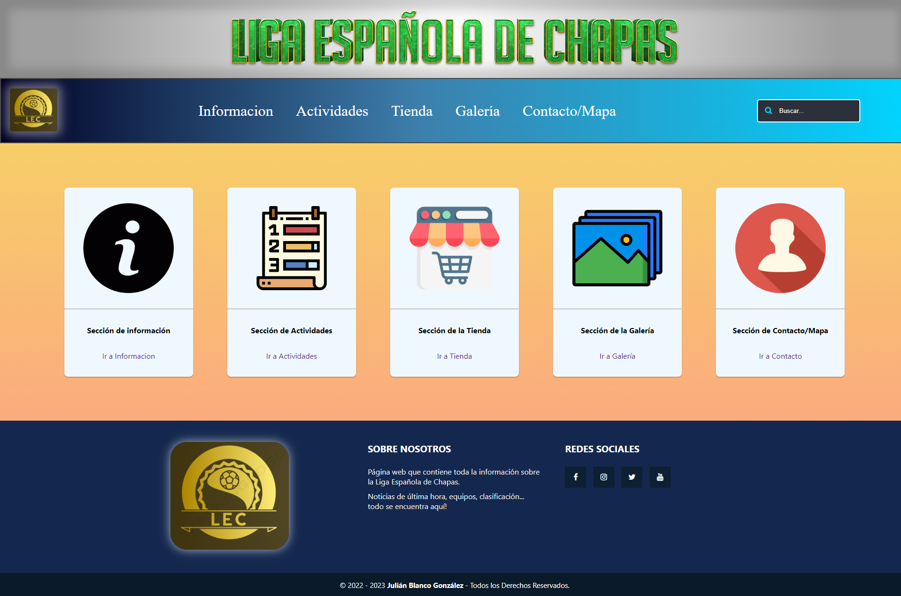
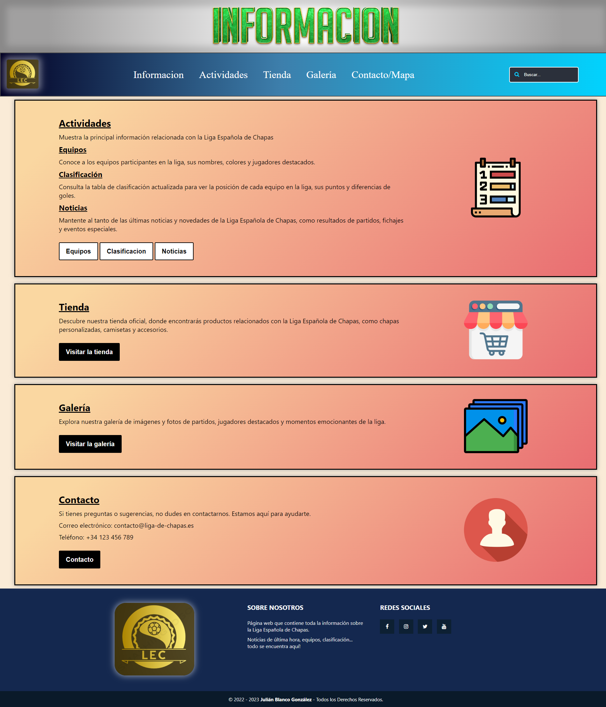
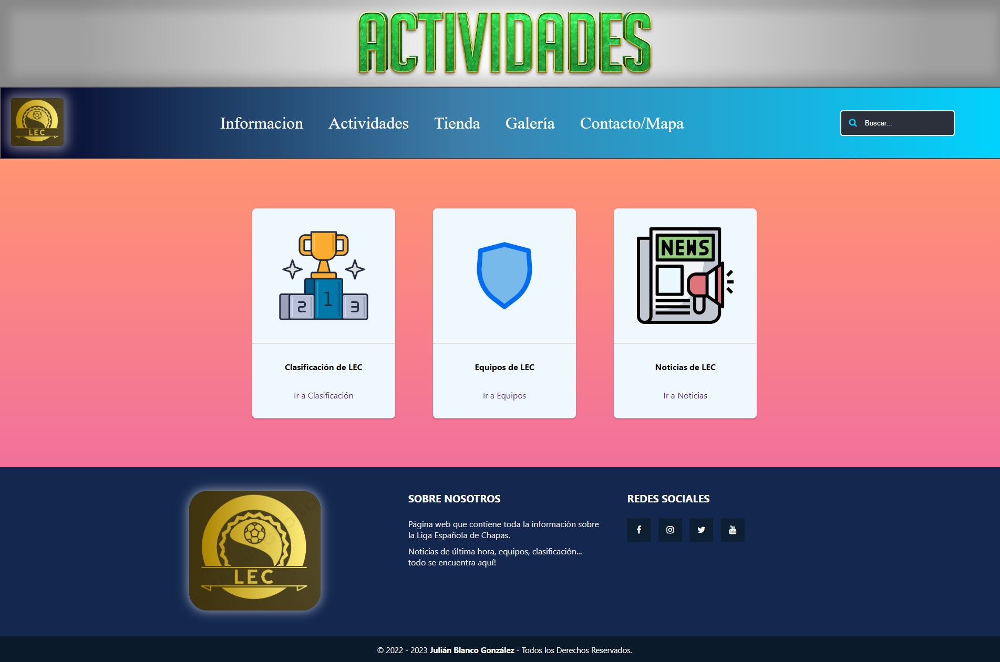
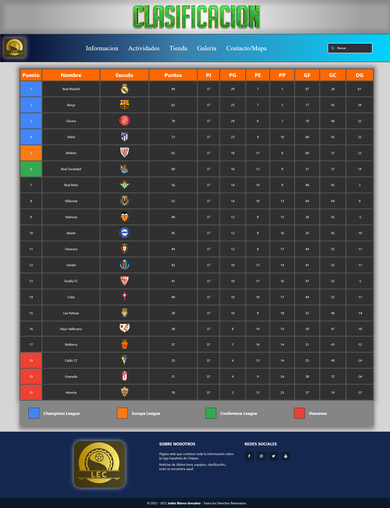
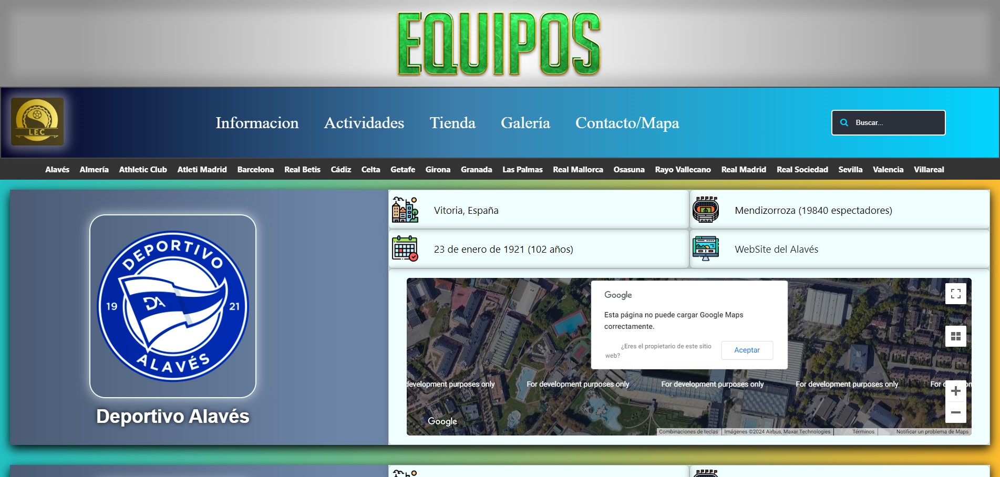
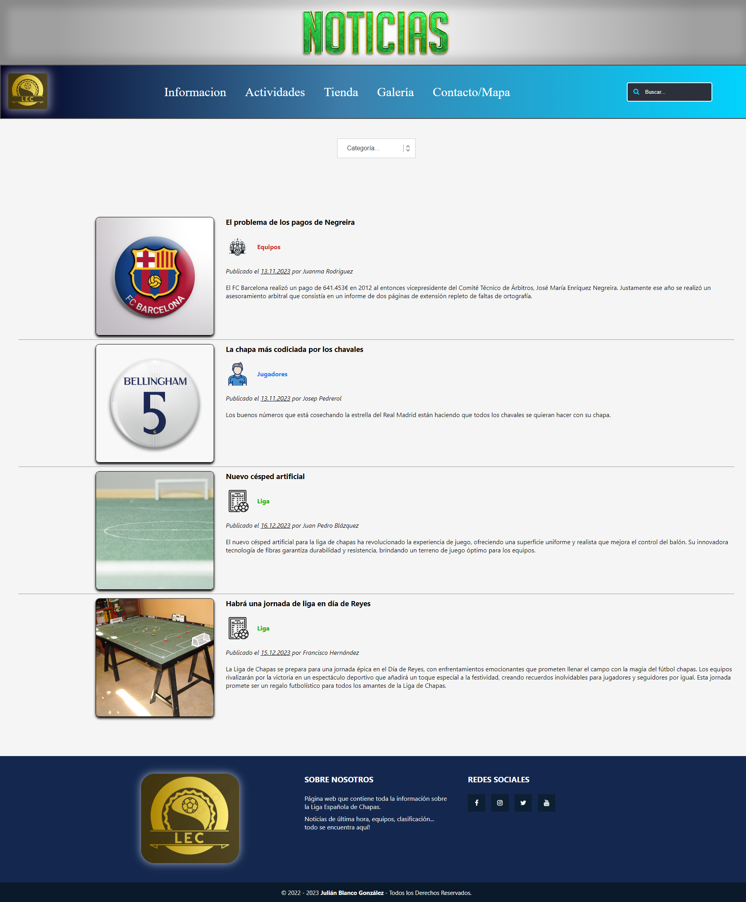
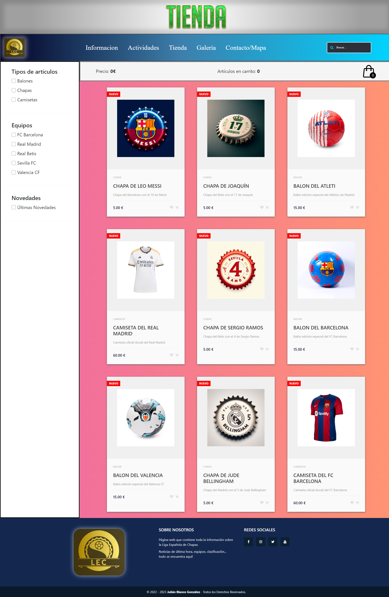
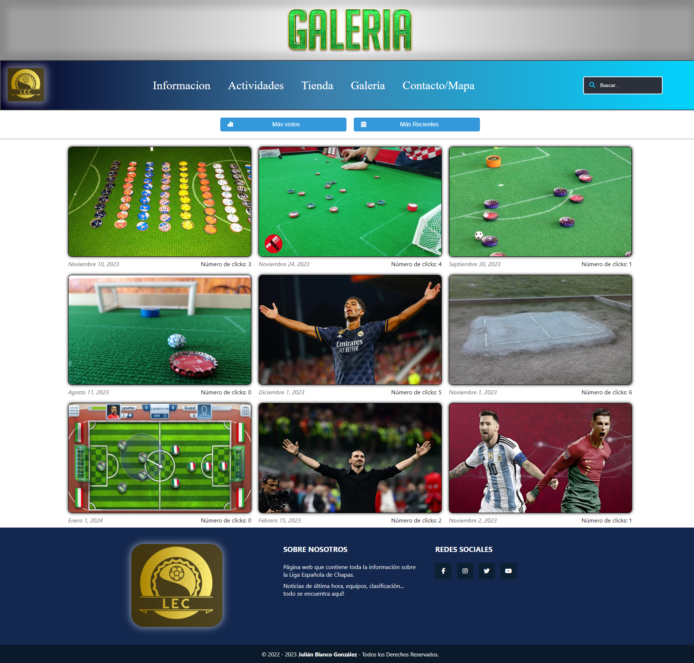
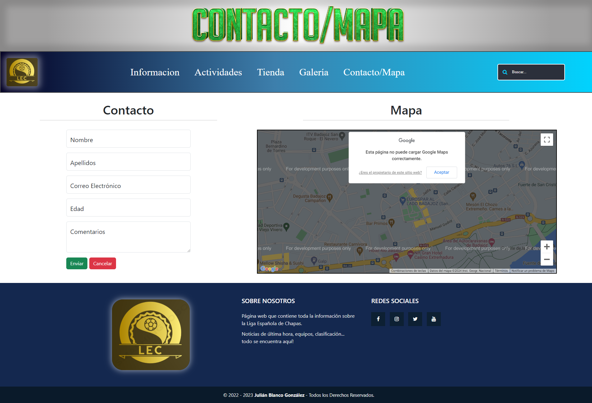

# Liga de Chapas

Proyecto Final de la Asignatura de Diseño Web del 4 año de Ingeniería Informática

## Descripción

El proyecto consiste en crear una aplicación web para mejorar en el apartado del Front End. El contenido de la aplicación es relacionado con una página web sobre una liga de chapas.

En mi caso, yo hice que la liga de chapas fuera como la Primera División Española de Fútbol.

## Tecnologías Usadas

### API´S HTML
- **Geolocation con Google Maps**: página de Equipos. Cargo los estadios de los 20 equipos de fútbol.
- **Local Storage**: Galería. Almacenar el número de clicks en una foto para ver las fotos más gustadas.

### JavaScript
- **Equipo**: botón de subir arriba en la página. Al ser la página más larga, he creado un botón para subir al top de la página.
- **Equipo**: crear con una función los 20 diferentes mapas.
- **Tienda**: carrito de la compra dinámico.
- **Tienda**: selectores de las categorías en la tienda.
- **Galería**: 2 botones para clasificar las imagenes por fecha y por número de clicks (localStorage)

### AJAX
- **Noticias**: la página se carga desde el XML que tengo guardado en la carpeta XML.

### COOKIES
- **Tienda**: guardo los artículos que el usuario le da MeGusta.

### BOOTSRAP
- **Contacto**: formulario de Contacto
- **Tienda**: div del carrito
- **Tienda**: toast de notificación cuando el usuario da MeGusta o lo quita (cookies)

### JQUERY
- **Noticias**: selector de noticias por categoría.

## Capturas del proyecto de los diferentes apartados

### Pantalla Principal

### Información

### Actividades

### Actividades/Clasificación

### Actividades/Equipos

### Actividades/Noticias

### Tienda

### Galería

### Contacto_Mapa

